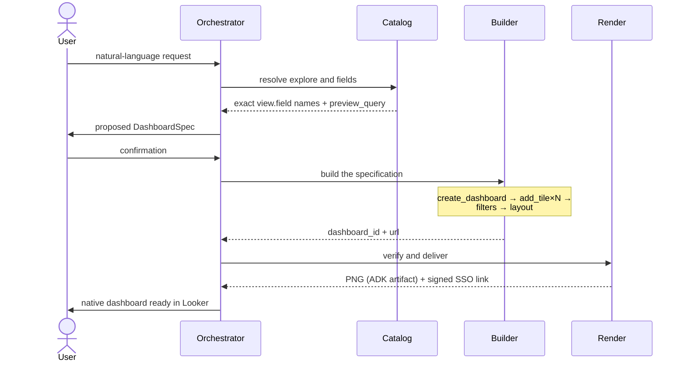

# bi-selfservice-agents

[Español](README.md) | **English** | [Français](README.fr.md) | [Português](README.pt.md)

A multi-agent system for analytics self-service on Looker. Starting from a natural-language request, the agents discover the semantic model (LookML), propose a dashboard specification, build it as native Looker content through its API, and deliver it visually verified. It is built on ADK (Agent Development Kit), communicates internally over the A2A protocol, exposes generative UI through A2UI, and deploys end-to-end with Terraform on Google Cloud, with registration in Gemini Enterprise.

## Contents

1. [Context and scope](#1-context-and-scope)
2. [Architecture](#2-architecture)
3. [Protocols: A2A and A2UI](#3-protocols-a2a-and-a2ui)
4. [Design decisions](#4-design-decisions)
5. [Security and governance](#5-security-and-governance)
6. [Repository structure](#6-repository-structure)
7. [Configuration](#7-configuration)
8. [Prerequisites](#8-prerequisites)
9. [Deployment](#9-deployment)
10. [Example flow](#10-example-flow)
11. [Operations and troubleshooting](#11-operations-and-troubleshooting)
12. [Planned evolution](#12-planned-evolution)

---

## 1. Context and scope

The first generation of conversational agents on BI platforms solves the *query*: they answer point questions and, at best, render a visualization as an image inside the chat. That pattern leaves the real self-service bottleneck untouched: the **creation of analytical content** still depends on the BI team, with request queues for every new dashboard or every variation of an existing one.

This project moves the frontier: the outcome of a conversation is not an ephemeral answer but a **persistent, governed artifact** — a real user-defined dashboard in Looker, with query-backed tiles, cross-tile filters, and a defined layout, which the user can open, edit, and share with the same guarantees as any hand-crafted content. Governance is not relaxed: everything the agents build goes through the LookML semantic layer, which remains the single source of metric and dimension definitions.

**In scope:** semantic catalog discovery, dashboard creation and editing (tiles, filters, layout), visual verification, delivery with signed links, two consumption surfaces (Gemini Enterprise and a custom A2UI frontend).
**Out of scope (see [Planned evolution](#12-planned-evolution)):** LookML authoring, alerts and schedules, other BI backends.

## 2. Architecture


*Diagram proportions: boxes with width:height ratio ≈ φ (tiers) or φ² (bars), per-tier widths in Fibonacci ×8 progression (104 → 168 → 272 → 440). Editable source at `docs/img/architecture.en.svg`.*

### Responsibilities

| Agent | Runtime | Responsibility | Main tools (Looker SDK) |
|---|---|---|---|
| **Orchestrator** | Agent Engine (+ optional Cloud Run for A2A/A2UI) | Interprets the request, negotiates the specification (`DashboardSpec`) with the user, delegates to specialists, manages confirmations | — (consumes `RemoteA2aAgent` sub-agents) |
| **Catalog** | Cloud Run (A2A, internal ingress) | Read-only authority over the semantic model: resolves models, explores, and exact `view.field` names; validates specifications with real previews | `all_lookml_models`, `lookml_model_explore`, `run_inline_query`, `search_dashboards` |
| **Builder** | Cloud Run (A2A, internal ingress) | The only write path: materializes the native dashboard and its components | `create_dashboard`, `create_query`, `create_dashboard_element`, `create_dashboard_filter`, layout components |
| **Render/QA** | Cloud Run (A2A, internal ingress) | Closes the loop: visual verification of the result and delivery of interactive access | `create_dashboard_render_task` (PNG → ADK artifact), `create_sso_embed_url` |
| **Deliverables** | Cloud Run (A2A, internal ingress) | Single gateway for deliverables: routes by format to the sub-squad and consolidates signed URLs; asks once if the format is ambiguous | — (consumes the 5 format specialists via `RemoteA2aAgent`) |
| **Tabular (Excel/CSV)** | Cloud Run (A2A, internal ingress) | Formatted .xlsx workbooks (query, multi-sheet, dashboard) and plain CSV for system interchange | openpyxl, `export_query_to_excel`, `export_multi_sheet_excel`, `export_dashboard_to_excel`, `export_query_to_csv` |
| **Slides** | Cloud Run (A2A, internal ingress) | .pptx presentations: cover + one slide per tile (per-query PNG render) with optional corporate template | python-pptx, `create_query_render_task`, `export_dashboard_to_slides` |
| **Docs** | Cloud Run (A2A, internal ingress) | .docx reports (one section per tile with image + data sample) and narrative documents by sections | python-docx, `export_dashboard_to_docx`, `create_document` |
| **PDF** | Cloud Run (A2A, internal ingress) | Native route (Looker PDF render, default) and composed route (cover + narrative + graphic appendix) | `create_dashboard_render_task(pdf)`, ReportLab, `compose_pdf_document` |
| **Data Exports** | Cloud Run (A2A, internal ingress) | Machine-readable formats for systems: JSON, Parquet and Avro with a type schema derived from LookML (not guessed from data); 100k-row API cap | pyarrow, fastavro, `export_query_to_json/parquet/avro` |

### Lifecycle of a request



Offline deliverables form a **two-level sub-squad**: the orchestrator delegates the intent ("send it to me as slides") to the Deliverables Agent, which routes by format to the right specialist. The intermediate level pays for itself with five formats — it keeps the orchestrator ignorant of each format's details — but it is deliberately the last level: the hierarchy must not grow to three.

The read/validation (Catalog) — write (Builder) — verification (Render) separation is not cosmetic: it bounds each agent's blast radius, allows the write path to be audited in isolation, and enables distinct IAM and network policies per responsibility.

## 3. Protocols: A2A and A2UI

**A2A (Agent2Agent)** is the contract between the orchestrator and the specialists. Each specialist publishes its `AgentCard` at `/.well-known/agent-card.json` and serves JSON-RPC over HTTP; the orchestrator discovers and consumes them as ADK `RemoteA2aAgent`s. The practical consequences: each agent is versioned, scaled, and deployed independently; a specialist can be reimplemented in another framework (LangGraph, a custom service) without touching the rest, as long as it honors the protocol; and the system stays open to third-party agents that speak A2A.

**A2UI** is the contract between the orchestrator and the interface. Instead of returning HTML or code, the agent emits declarative component *blueprints* (JSON with a data model and bindings) traveling as `DataPart`s with MIME `application/json+a2ui` over the same A2A connection. The host renders them with its own native components, which keeps executable code out of the agent→UI channel (relevant to the trust boundary, see §5) and makes the same response portable across renderers (Lit, Angular, Flutter). The orchestrator advertises the A2UI extension in its AgentCard; the UI contract (spec wizard, preview card, destructive confirmations) is injected into the system prompt via `A2uiSchemaManager` only when `A2UI_ENABLED=true`.

## 4. Design decisions

**The Catalog Agent as the anti-hallucination barrier.** The dominant risk of a system that writes BI content is building tiles on nonexistent or misremembered fields. The system's rule is that the Builder only accepts fields with an exact `view.field` name previously resolved by the Catalog against LookML, and that every specification is validated with at least one real `preview_query` before being materialized. The model never "remembers" the schema: it queries it.

**Two surfaces, one logic.** Gemini Enterprise does not render A2UI; the custom frontend does. Instead of forking agents, the difference is reduced to a per-deployment flag: in GE the experience is composed of text, inline images, and signed links; in the A2UI frontend, of wizards and interactive cards. The four agents and their tools are identical on both surfaces.

**Images as artifacts, never as text.** Render PNGs are stored through the ADK artifacts mechanism (`tool_context.save_artifact`) and the runtime displays them inline. Bytes never pass through the model's text — it is the only reliable path in Gemini Enterprise and avoids bloated or truncated responses.

**Swappable reasoning model.** The LLM backend is decided by configuration (`AGENT_MODEL_PROVIDER`), not by code, and can be set per agent:

| Route | Backend | When to use it |
|---|---|---|
| `gemini` | Gemini on Vertex AI (direct ADK string) | Default; no extra requirements |
| `claude` | Claude on Vertex AI via LiteLlm | Claude with GCP billing and residency |
| `claude_native` | Claude on Vertex via ADK's native wrapper | Alternative when the GE↔LiteLlm streaming boundary misbehaves |
| `anthropic` | Anthropic public API | When Model Garden enablement isn't available |

A reasonable production mix: a fast, inexpensive model for the Catalog (high call volume, bounded task) and a higher-capability model for the orchestrator (negotiating the specification with the user).

**Organizational templates before free-form design.** Recurring dashboards and workbooks are defined as versioned templates in `templates/` (parameterized YAML with `{{ placeholders }}` for dashboards; branded base `.xlsx` for Excel) that Terraform publishes to the bucket on every apply. The orchestrator proposes them before designing from scratch — consistency over creativity —, asks only for the declared parameters, the Catalog validates every field, and the Builder materializes with `create_dashboard_from_template`. Changing a template is a pull request, not a manual edit: governance of recurring content lives in the same review cycle as the code.

**Anti-sprawl rule: when an agent, when a tool.** So the sub-squad doesn't grow without criteria, the rule is explicit: a new format from an existing family is a **tool** in that family's agent (CSV and JSON didn't earn their own agents); a new **family** of deliverables — with its own dependencies, risk posture and evolution cycle — is an **agent** in the sub-squad (Slides, PDF, Data Exports); and a **publishing destination** (Iceberg tables in the lakehouse, Google Drive) is not a deliverable but an integration: a separate agent, outside deliverables, with its own approval process. Fan-out stays bounded per level (root: 4; deliverables: 5) and the hierarchy never grows to three levels.

**Signed links in a separate tool.** `create_sso_embed_url` is independent of rendering: producing the interactive link never blocks nor depends on PNG generation, and vice versa.

## 5. Security and governance

- **Least privilege on GCP.** A single service account for the agents with four roles (`aiplatform.user`, `storage.objectAdmin`, `secretmanager.secretAccessor`, `logging.logWriter`). The deployer can operate with a granular set documented in `docs/`.
- **Specialists not exposed.** Catalog, Builder, and Render deploy with internal ingress and only accept IAM-authenticated invocations (`roles/run.invoker` for the orchestrator's SA). The only optional public surface is the orchestrator's A2A/A2UI one.
- **Looker credentials only in Secret Manager.** Never in versioned Terraform variables, images, or logs. Containers receive them as secret references, not values.
- **Bounded scope in Looker.** The `LOOKER_MODELS` allowlist limits which LookML models are visible to the agents; `LOOKER_TARGET_FOLDER_ID` confines writes to a specific folder whose edit permission is controlled by the Looker administrator. The service user's permission set defines the real capability ceiling.
- **Destructive operations require confirmation.** Dashboard deletion is a soft delete (Looker trash) and requires explicit user confirmation; on the A2UI surface, via a dedicated confirmation card.
- **Trust boundary at the UI.** A2UI guarantees that only declarative descriptions of components from a closed catalog travel from agent to interface — never HTML or scripts — eliminating the class of code-injection risks in the generative-UI channel.

## 6. Repository structure

```
agents/
├── common/            # model_factory (swappable model) + Looker SDK client
├── orchestrator/      # root LlmAgent + RemoteA2aAgent + A2UI contract + entrypoints
│   ├── agent.py             #   A2A sub_agents
│   ├── a2ui_prompt.py       #   A2uiSchemaManager → system prompt with schema/examples
│   ├── agent_engine_app.py  #   Agent Engine entrypoint (AdkApp)
│   └── __main__.py          #   A2A+A2UI server (Cloud Run, custom frontend)
├── catalog_agent/     # semantic discovery (read)
├── builder_agent/     # dashboard creation (write)
├── render_agent/      # inline PNG (artifacts) + SSO embed
├── deliverables_agent/# router for the format sub-squad (A2A)
├── excel_agent/       # tabular: formatted .xlsx + CSV (openpyxl)
├── slides_agent/      # .pptx presentations (python-pptx + per-tile render)
├── docs_agent/        # .docx documents (python-docx)
├── pdf_agent/         # native Looker PDF + composed (ReportLab)
├── data_exports_agent/# JSON/Parquet/Avro with LookML-derived schema (pyarrow/fastavro)
└── cloudbuild.yaml    # per-agent build (context shared with common/)

terraform/
├── versions.tf  variables.tf  outputs.tf  terraform.tfvars.example
├── foundation.tf        # APIs, SA + least-privilege IAM, bucket, Secret Manager
├── cloud_run_agents.tf  # Artifact Registry, Cloud Build, 3 internal Cloud Run services
│                        # + public A2A/A2UI surface of the orchestrator
├── agent_engine.tf      # packaging → GCS → Reasoning Engine → GE registration
└── scripts/
    ├── build_source.py        # packages common+orchestrator (tar.gz)
    ├── deploy_agent_engine.py # SDK deploy fallback (agent_engines.create)
    └── register_agent.sh      # Gemini Enterprise registration (Discovery Engine API)

frontend/README.md       # how to connect an A2UI renderer (Lit/Angular/Flutter/CopilotKit)
docs/                    # prerequisites for approval (client/vendor)
templates/               # organizational templates (dashboards/*.yaml, excel/*.xlsx)
                         # versioned in git; terraform apply publishes them to the bucket
```

## 7. Configuration

Relevant environment variables (injected by Terraform; listed for operations and debugging):

| Variable | Scope | Description |
|---|---|---|
| `AGENT_MODEL_PROVIDER` | all | `gemini` \| `claude` \| `claude_native` \| `anthropic` |
| `GEMINI_MODEL` / `CLAUDE_MODEL` | all | Model identifier per route |
| `CLAUDE_LOCATION` | all | Vertex region serving Claude (e.g., `us-east5`) |
| `LOOKERSDK_BASE_URL` | all | Looker API URL |
| `LOOKERSDK_CLIENT_ID` / `_SECRET` | all | Secret Manager references |
| `LOOKER_MODELS` | all | JSON allowlist of LookML models |
| `LOOKER_TARGET_FOLDER_ID` | builder | Target folder for created dashboards |
| `A2UI_ENABLED` | orchestrator | Enables the A2UI contract in the system prompt |
| `CATALOG/BUILDER/RENDER_AGENT_URL` | orchestrator | Specialists' A2A endpoints |
| `PUBLIC_URL` | specialists | URL advertised by the AgentCard (Cloud Run) |
| `EXPORT_BUCKET` / `EXPORT_URL_EXPIRY_HOURS` | sub-squad | Exports bucket and signed-URL expiry (default 24 h; auto-cleanup after 7 days) |
| `EXCEL/SLIDES/DOCS/PDF/DATA_AGENT_URL` | deliverables | A2A endpoints of the format specialists |
| `DELIVERABLES_AGENT_URL` | orchestrator | Single gateway to the deliverables sub-squad |
| `TEMPLATES_BUCKET` / `TEMPLATES_PREFIX` | all | Location of the organizational templates published by Terraform |

## 8. Prerequisites

- GCP project with billing; Owner role or the documented granular set; authenticated `gcloud`; Terraform ≥ 1.7; `python3`.
- A **Looker** instance with API credentials for a service user whose permission set includes `access_data`, `explore`, and **dashboard write** (`create_dashboards` / `manage_dashboards` on the target folder), plus a model set with the authorized models.
- **SSO Embed enabled** in Looker (Admin → Embed) for the interactive links.
- A **Gemini Enterprise** app created (its `AS_APP` id and location are required).
- For Claude routes: model enabled in **Vertex AI Model Garden** (or `ANTHROPIC_API_KEY` for the `anthropic` route).

The full detail, organized by responsible team and with a client/vendor signature sheet, lives in `docs/prerrequisitos_looker_selfservice_agents.docx`.

## 9. Deployment

```bash
cd terraform
cp terraform.tfvars.example terraform.tfvars   # then fill it in
terraform init
terraform plan
terraform apply
```

Order Terraform resolves: APIs → SA/IAM → bucket → secrets → image builds (Cloud Build) → 3 internal Cloud Run services → orchestrator A2A surface → packaging + Reasoning Engine → Gemini Enterprise registration (`register_agent.sh`).

> **Caveats:**
> 1. `google_vertex_ai_reasoning_engine` is recent in `google-beta`: verify the nested `spec` names against your provider version. If your version doesn't yet support ADK source packaging, `scripts/deploy_agent_engine.py` reaches the same end state via SDK; pass the resulting engine id to `register_agent.sh`.
> 2. Gemini Enterprise registration is not idempotent (no native Terraform resource yet): re-applying may duplicate the agent in the app.
> 3. The `requirements.txt` pins are for reference: pin the exact versions you validate in your build so build and runtime match.

## 10. Example flow

Request in Gemini Enterprise:

> "I want an e-commerce sales dashboard: revenue by month, top 10 countries by orders, average ticket as a single value, and a table of orders by status. Global filter by country."

1. The orchestrator delegates to the **Catalog**: resolves `thelook/order_items`, obtains the exact names (`orders.created_month`, `order_items.total_revenue`, …), and runs a validation `preview_query`.
2. It proposes the `DashboardSpec` (title, four tiles with fields and visualization type, global filter, two-column layout) and waits for confirmation.
3. The **Builder** executes the sequence `create_dashboard` → 4× `add_tile` → `add_dashboard_filter` + `wire_filter_to_tiles` → `apply_grid_layout(2)` and returns the `dashboard_id` and URL.
4. The **Render** delivers the inline PNG and the signed SSO link.
5. The dashboard lands in the Looker target folder: native, editable, shareable. A follow-up "and send it to me in Excel and as slides for the committee" delegates to the **Deliverables Agent**, which routes to the format specialists and consolidates the signed download URLs.

On the A2UI frontend, steps 1–2 are presented as an interactive wizard (explore, field, and chart-type selection) and step 4 as a preview card with actions — same agents, no duplicated logic.

## 11. Operations and troubleshooting

| Symptom | Likely cause and action |
|---|---|
| `cannot access data` | Insufficient permission set or model set on the Looker API credentials. `list_models` shows the actual reach. |
| The Builder fails creating tiles | `create_dashboards`/`manage_dashboards` missing, or `LOOKER_TARGET_FOLDER_ID` not writable by the service user. |
| Claude answers via direct `stream_query` but GE returns empty | GE↔LiteLlm streaming boundary. Switch to `claude_native`, or `gemini` on the GE-facing agent (specialists can stay on Claude). |
| `Environment variable 'GOOGLE_CLOUD_PROJECT' is reserved` | Agent Engine sets that variable itself; the project uses `VERTEXAI_PROJECT`/`VERTEXAI_LOCATION` precisely for that reason. |
| A specialist's AgentCard advertises `localhost` | `PUBLIC_URL` missing or wrong in the Cloud Run revision. |
| Render times out | Looker render service saturated or disabled; check render tasks on the instance. |

Observability: all four agents write to Cloud Logging (`logging.logWriter` role); ADK traces can be enabled in `agent_engine_app.py` (`enable_tracing=True`) for inspection in Cloud Trace.

## 12. Planned evolution

The project's `bi-` prefix is deliberate: the architecture is coupled to Looker only in the specialists' tools. Natural extensions, each as a new A2A agent without touching the existing ones:

- **High-volume route for Data Exports** — above ~100k rows, delegate the `EXPORT DATA (format='PARQUET')` to BigQuery using the SQL Looker generates for the query: data never passes through the agent and governance is preserved (the SQL is born from LookML). Requires `bigquery.jobUser` and dataset read access.
- **Out of scope by design**: publishing to *table* formats (Iceberg/BigLake). They are destinations, not deliverables; they would belong to a Data Publisher Agent with its own approval process, not to the sub-squad.
- **Google Workspace output** — each format specialist can offer, besides the downloadable file, its collaborative equivalent (Google Sheets/Slides/Docs via API) delivered as a Drive link; requires resolving service-account scopes and the target shared Drive.
- **LookML Author Agent** — propose new dimensions/measures as pull requests to the LookML repository, closing the governance loop when the catalog doesn't cover a request.
- **Scheduler Agent** — alerts and scheduled deliveries (`create_scheduled_plan`) on the created dashboards.
- **Specialists for other backends** — an equivalent Builder for another BI platform would reuse the orchestrator, the A2UI contract, and the Catalog/Builder/Render pattern in full.
- **Continuous evaluation** — a battery of reference requests against a staging environment to measure quality regressions when switching model or agent version.

## Author

Jose Maldonado
