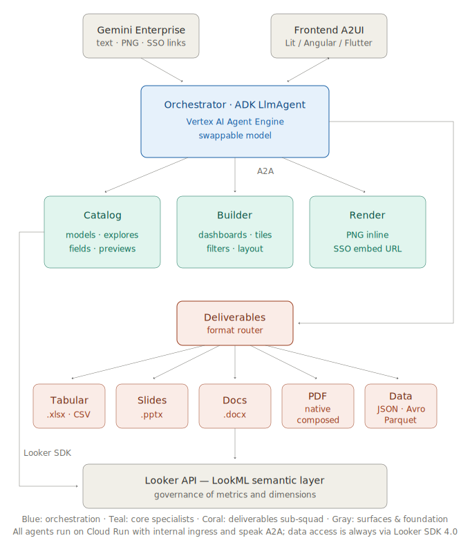
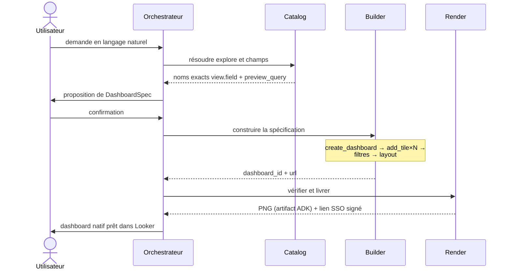

# bi-selfservice-agents

[Español](README.md) | [English](README.en.md) | **Français** | [Português](README.pt.md)

Système multi-agents pour le self-service analytique sur Looker. À partir d'une demande en langage naturel, les agents découvrent le modèle sémantique (LookML), proposent une spécification de dashboard, la construisent comme contenu natif de Looker via son API et la livrent vérifiée visuellement. Il repose sur ADK (Agent Development Kit), communique en interne via le protocole A2A, expose une UI générative grâce à A2UI et se déploie de bout en bout avec Terraform sur Google Cloud, avec enregistrement dans Gemini Enterprise.

## Sommaire

1. [Contexte et périmètre](#1-contexte-et-périmètre)
2. [Architecture](#2-architecture)
3. [Protocoles : A2A et A2UI](#3-protocoles--a2a-et-a2ui)
4. [Décisions de conception](#4-décisions-de-conception)
5. [Sécurité et gouvernance](#5-sécurité-et-gouvernance)
6. [Structure du dépôt](#6-structure-du-dépôt)
7. [Configuration](#7-configuration)
8. [Prérequis](#8-prérequis)
9. [Déploiement](#9-déploiement)
10. [Flux d'exemple](#10-flux-dexemple)
11. [Exploitation et dépannage](#11-exploitation-et-dépannage)
12. [Évolutions prévues](#12-évolutions-prévues)

---

## 1. Contexte et périmètre

La première génération d'agents conversationnels sur les plateformes de BI résout la *requête* : ils répondent à des questions ponctuelles et, au mieux, affichent une visualisation sous forme d'image dans le chat. Ce schéma laisse intact le véritable goulot d'étranglement du self-service : la **création de contenu analytique** dépend toujours de l'équipe BI, avec des files d'attente pour chaque nouveau tableau de bord ou chaque variante d'un existant.

Ce projet déplace la frontière : le résultat d'une conversation n'est pas une réponse éphémère mais un **artefact persistant et gouverné** — un vrai dashboard user-defined dans Looker, avec des tuiles adossées à des requêtes, des filtres cross-tile et une mise en page définie, que l'utilisateur peut ouvrir, éditer et partager avec les mêmes garanties que n'importe quel contenu créé à la main. La gouvernance n'est pas assouplie : tout ce que les agents construisent passe par la couche sémantique LookML, qui reste l'unique source des définitions de métriques et de dimensions.

**Dans le périmètre :** découverte du catalogue sémantique, création et édition de dashboards (tuiles, filtres, mise en page), vérification visuelle, livraison avec liens signés, deux surfaces de consommation (Gemini Enterprise et un frontend A2UI dédié).
**Hors périmètre (voir [Évolutions prévues](#12-évolutions-prévues)) :** l'écriture de LookML, les alertes et planifications, d'autres backends de BI.

## 2. Architecture



*Proportions du diagramme : boîtes au ratio largeur:hauteur ≈ φ (niveaux) ou φ² (barres), largeurs par niveau en progression Fibonacci ×8 (104 → 168 → 272 → 440). Source éditable dans `docs/img/architecture.en.svg`.*

### Responsabilités

| Agent | Runtime | Responsabilité | Tools principaux (Looker SDK) |
|---|---|---|---|
| **Orchestrator** | Agent Engine (+ Cloud Run optionnel pour A2A/A2UI) | Interprète la demande, négocie la spécification (`DashboardSpec`) avec l'utilisateur, délègue aux spécialistes, gère les confirmations | — (consomme des sous-agents `RemoteA2aAgent`) |
| **Catalog** | Cloud Run (A2A, ingress interne) | Autorité en lecture seule sur le modèle sémantique : résout modèles, explores et noms exacts `view.field` ; valide les spécifications avec des aperçus réels | `all_lookml_models`, `lookml_model_explore`, `run_inline_query`, `search_dashboards` |
| **Builder** | Cloud Run (A2A, ingress interne) | L'unique chemin d'écriture : matérialise le dashboard natif et ses composants | `create_dashboard`, `create_query`, `create_dashboard_element`, `create_dashboard_filter`, layout components |
| **Render/QA** | Cloud Run (A2A, ingress interne) | Boucle la boucle : vérification visuelle du résultat et livraison de l'accès interactif | `create_dashboard_render_task` (PNG → artifact ADK), `create_sso_embed_url` |
| **Deliverables** | Cloud Run (A2A, ingress interne) | Porte unique des livrables : route par format vers la sous-escouade et consolide les URLs signées ; demande une seule fois si le format est ambigu | — (consomme les 5 spécialistes de format via `RemoteA2aAgent`) |
| **Tabulaire (Excel/CSV)** | Cloud Run (A2A, ingress interne) | Classeurs .xlsx mis en forme (requête, multi-feuilles, dashboard) et CSV brut pour l'échange entre systèmes | openpyxl, `export_query_to_excel`, `export_multi_sheet_excel`, `export_dashboard_to_excel`, `export_query_to_csv` |
| **Slides** | Cloud Run (A2A, ingress interne) | Présentations .pptx : couverture + une diapositive par tuile (rendu PNG par requête) avec template d'entreprise optionnel | python-pptx, `create_query_render_task`, `export_dashboard_to_slides` |
| **Docs** | Cloud Run (A2A, ingress interne) | Rapports .docx (une section par tuile avec image + échantillon de données) et documents narratifs par sections | python-docx, `export_dashboard_to_docx`, `create_document` |
| **PDF** | Cloud Run (A2A, ingress interne) | Route native (rendu PDF de Looker, par défaut) et route composée (couverture + narration + annexe graphique) | `create_dashboard_render_task(pdf)`, ReportLab, `compose_pdf_document` |
| **Data Exports** | Cloud Run (A2A, ingress interne) | Formats machine-readable pour les systèmes : JSON, Parquet et Avro avec schéma de types dérivé de LookML (jamais deviné des données) ; plafond 100k lignes par API | pyarrow, fastavro, `export_query_to_json/parquet/avro` |

### Cycle de vie d'une demande



Les livrables hors ligne forment une **sous-escouade à deux niveaux** : l'orchestrateur délègue l'intention (« envoie-le-moi en slides ») au Deliverables Agent, qui route par format vers le bon spécialiste. Le niveau intermédiaire se justifie avec cinq formats — il garde l'orchestrateur ignorant des détails de chaque format — mais c'est délibérément le dernier niveau : la hiérarchie ne doit pas croître à trois.

La séparation lecture/validation (Catalog) — écriture (Builder) — vérification (Render) n'est pas cosmétique : elle borne le rayon d'action de chaque agent, permet d'auditer le chemin d'écriture de façon isolée et autorise des politiques IAM et réseau distinctes par responsabilité.

## 3. Protocoles : A2A et A2UI

**A2A (Agent2Agent)** est le contrat entre l'orchestrateur et les spécialistes. Chaque spécialiste publie son `AgentCard` sur `/.well-known/agent-card.json` et sert du JSON-RPC sur HTTP ; l'orchestrateur les découvre et les consomme en tant que `RemoteA2aAgent` de l'ADK. Conséquences pratiques : chaque agent se versionne, se met à l'échelle et se déploie indépendamment ; un spécialiste peut être réimplémenté dans un autre framework (LangGraph, un service maison) sans toucher au reste, tant qu'il respecte le protocole ; et le système reste ouvert à des agents tiers parlant A2A.

**A2UI** est le contrat entre l'orchestrateur et l'interface. Au lieu de renvoyer du HTML ou du code, l'agent émet des *blueprints* déclaratifs de composants (JSON avec data model et bindings) qui voyagent comme `DataPart` avec le MIME `application/json+a2ui` sur la même connexion A2A. L'hôte les affiche avec ses propres composants natifs, ce qui garde le code exécutable hors du canal agent→UI (pertinent pour la frontière de confiance, voir §5) et rend la même réponse portable entre renderers (Lit, Angular, Flutter). L'orchestrateur annonce l'extension A2UI dans son AgentCard ; le contrat d'UI (wizard de spécification, carte d'aperçu, confirmations destructives) n'est injecté dans le system prompt via `A2uiSchemaManager` que lorsque `A2UI_ENABLED=true`.

## 4. Décisions de conception

**Le Catalog Agent comme barrière anti-hallucination.** Le risque dominant d'un système qui écrit du contenu BI est de construire des tuiles sur des champs inexistants ou mal mémorisés. La règle du système : le Builder n'accepte que des champs au nom exact `view.field` préalablement résolus par le Catalog contre LookML, et toute spécification est validée par au moins un `preview_query` réel avant d'être matérialisée. Le modèle ne « se souvient » jamais du schéma : il l'interroge.

**Deux surfaces, une seule logique.** Gemini Enterprise n'affiche pas l'A2UI ; le frontend dédié, si. Plutôt que de bifurquer les agents, la différence se réduit à un flag par déploiement : dans GE, l'expérience se compose de texte, d'images inline et de liens signés ; dans le frontend A2UI, de wizards et de cartes interactives. Les quatre agents et leurs tools sont identiques sur les deux surfaces.

**Des images comme artifacts, jamais comme texte.** Les PNG de rendu sont stockés via le mécanisme d'artifacts de l'ADK (`tool_context.save_artifact`) et le runtime les affiche inline. Les octets ne traversent jamais le texte du modèle — c'est la seule voie fiable dans Gemini Enterprise et cela évite des réponses gonflées ou tronquées.

**Modèle de raisonnement interchangeable.** Le backend LLM se décide par configuration (`AGENT_MODEL_PROVIDER`), pas par le code, et peut être fixé par agent :

| Route | Backend | Quand l'utiliser |
|---|---|---|
| `gemini` | Gemini sur Vertex AI (string direct de l'ADK) | Défaut ; aucune exigence supplémentaire |
| `claude` | Claude sur Vertex AI via LiteLlm | Claude avec facturation et résidence GCP |
| `claude_native` | Claude sur Vertex via le wrapper natif de l'ADK | Alternative quand la frontière de streaming GE↔LiteLlm pose problème |
| `anthropic` | API publique d'Anthropic | Quand l'activation Model Garden n'est pas disponible |

Un mix de production raisonnable : un modèle rapide et économique pour le Catalog (fort volume d'appels, tâche bornée) et un modèle plus capable pour l'orchestrateur (négociation de la spécification avec l'utilisateur).

**Templates organisationnels avant la conception libre.** Les dashboards et classeurs récurrents sont définis comme templates versionnés dans `templates/` (YAML paramétré avec des `{{ placeholders }}` pour les dashboards ; `.xlsx` de base avec branding pour Excel) que Terraform publie vers le bucket à chaque apply. L'orchestrateur les propose avant toute conception de zéro — la cohérence avant la créativité —, ne demande que les paramètres déclarés, le Catalog valide chaque champ et le Builder matérialise avec `create_dashboard_from_template`. Modifier un template est une pull request, pas une édition manuelle : la gouvernance du contenu récurrent vit dans le même cycle de revue que le code.

**Règle anti-prolifération : quand un agent, quand un tool.** Pour que la sous-escouade ne grandisse pas sans critère, la règle est explicite : un nouveau format d'une famille existante est un **tool** dans l'agent de cette famille (CSV et JSON n'ont pas mérité leur propre agent) ; une nouvelle **famille** de livrables — avec ses dépendances, sa posture de risque et son cycle d'évolution propres — est un **agent** dans la sous-escouade (Slides, PDF, Data Exports) ; et une **destination de publication** (tables Iceberg dans le lakehouse, Google Drive) n'est pas un livrable mais une intégration : agent séparé, hors deliverables, avec son propre processus d'approbation. Le fan-out reste borné par niveau (racine : 4 ; deliverables : 5) et la hiérarchie ne croît jamais à trois niveaux.

**Liens signés dans un tool séparé.** `create_sso_embed_url` est indépendant du rendu : produire le lien interactif ne bloque jamais la génération du PNG et n'en dépend pas, et réciproquement.

## 5. Sécurité et gouvernance

- **Moindre privilège sur GCP.** Un unique service account pour les agents avec quatre rôles (`aiplatform.user`, `storage.objectAdmin`, `secretmanager.secretAccessor`, `logging.logWriter`). Le déployeur peut opérer avec un ensemble granulaire documenté dans `docs/`.
- **Spécialistes non exposés.** Catalog, Builder et Render se déploient avec un ingress interne et n'acceptent que des invocations authentifiées par IAM (`roles/run.invoker` pour la SA de l'orchestrateur). La seule surface publique optionnelle est celle A2A/A2UI de l'orchestrateur.
- **Identifiants Looker uniquement dans Secret Manager.** Jamais dans des variables Terraform versionnées, des images ou des logs. Les conteneurs les reçoivent comme références à des secrets, pas comme valeurs.
- **Périmètre borné dans Looker.** L'allowlist `LOOKER_MODELS` limite les modèles LookML visibles par les agents ; `LOOKER_TARGET_FOLDER_ID` confine l'écriture à un dossier précis dont la permission d'édition est contrôlée par l'administrateur Looker. Le permission set de l'utilisateur de service définit le plafond réel des capacités.
- **Opérations destructives avec confirmation.** La suppression de dashboards est un soft delete (corbeille de Looker) et exige la confirmation explicite de l'utilisateur ; sur la surface A2UI, via une carte de confirmation dédiée.
- **Frontière de confiance côté UI.** A2UI garantit que seules des descriptions déclaratives de composants d'un catalogue fermé voyagent de l'agent vers l'interface — jamais de HTML ni de scripts — éliminant la classe des risques d'injection de code dans le canal d'UI générative.

## 6. Structure du dépôt

```
agents/
├── common/            # model_factory (modèle interchangeable) + client Looker SDK
├── orchestrator/      # LlmAgent racine + RemoteA2aAgent + contrat A2UI + entrypoints
│   ├── agent.py             #   sous-agents A2A
│   ├── a2ui_prompt.py       #   A2uiSchemaManager → system prompt avec schéma/exemples
│   ├── agent_engine_app.py  #   entrypoint Agent Engine (AdkApp)
│   └── __main__.py          #   serveur A2A+A2UI (Cloud Run, frontend dédié)
├── catalog_agent/     # découverte sémantique (lecture)
├── builder_agent/     # création de dashboards (écriture)
├── render_agent/      # PNG inline (artifacts) + SSO embed
├── deliverables_agent/# routeur de la sous-escouade de formats (A2A)
├── excel_agent/       # tabulaire : .xlsx mis en forme + CSV (openpyxl)
├── slides_agent/      # présentations .pptx (python-pptx + rendu par tuile)
├── docs_agent/        # documents .docx (python-docx)
├── pdf_agent/         # PDF natif de Looker + composé (ReportLab)
├── data_exports_agent/# JSON/Parquet/Avro avec schéma dérivé de LookML (pyarrow/fastavro)
└── cloudbuild.yaml    # build par agent (contexte partagé avec common/)

terraform/
├── versions.tf  variables.tf  outputs.tf  terraform.tfvars.example
├── foundation.tf        # APIs, SA + IAM moindre privilège, bucket, Secret Manager
├── cloud_run_agents.tf  # Artifact Registry, Cloud Build, 3 Cloud Run internes
│                        # + surface A2A/A2UI publique de l'orchestrateur
├── agent_engine.tf      # packaging → GCS → Reasoning Engine → enregistrement GE
└── scripts/
    ├── build_source.py        # empaquette common+orchestrator (tar.gz)
    ├── deploy_agent_engine.py # déploiement de secours via SDK (agent_engines.create)
    └── register_agent.sh      # enregistrement dans Gemini Enterprise (Discovery Engine API)

frontend/README.md       # comment connecter un renderer A2UI (Lit/Angular/Flutter/CopilotKit)
docs/                    # prérequis pour approbation (client/fournisseur)
templates/               # templates organisationnels (dashboards/*.yaml, excel/*.xlsx)
                         # versionnés dans git ; terraform apply les publie vers le bucket
```

## 7. Configuration

Variables d'environnement pertinentes (injectées par Terraform ; listées pour l'exploitation et le débogage) :

| Variable | Portée | Description |
|---|---|---|
| `AGENT_MODEL_PROVIDER` | tous | `gemini` \| `claude` \| `claude_native` \| `anthropic` |
| `GEMINI_MODEL` / `CLAUDE_MODEL` | tous | Identifiant du modèle par route |
| `CLAUDE_LOCATION` | tous | Région Vertex servant Claude (p. ex. `us-east5`) |
| `LOOKERSDK_BASE_URL` | tous | URL de l'API Looker |
| `LOOKERSDK_CLIENT_ID` / `_SECRET` | tous | Références Secret Manager |
| `LOOKER_MODELS` | tous | Allowlist JSON de modèles LookML |
| `LOOKER_TARGET_FOLDER_ID` | builder | Dossier cible des dashboards créés |
| `A2UI_ENABLED` | orchestrateur | Active le contrat A2UI dans le system prompt |
| `CATALOG/BUILDER/RENDER_AGENT_URL` | orchestrateur | Endpoints A2A des spécialistes |
| `PUBLIC_URL` | spécialistes | URL annoncée par l'AgentCard (Cloud Run) |
| `EXPORT_BUCKET` / `EXPORT_URL_EXPIRY_HOURS` | sous-escouade | Bucket des exports et expiration des URLs signées (24 h par défaut ; nettoyage automatique à 7 jours) |
| `EXCEL/SLIDES/DOCS/PDF/DATA_AGENT_URL` | deliverables | Endpoints A2A des spécialistes de format |
| `DELIVERABLES_AGENT_URL` | orchestrateur | Porte unique de la sous-escouade de livrables |
| `TEMPLATES_BUCKET` / `TEMPLATES_PREFIX` | tous | Emplacement des templates organisationnels publiés par Terraform |

## 8. Prérequis

- Projet GCP avec facturation ; rôle Owner ou l'ensemble granulaire documenté ; `gcloud` authentifié ; Terraform ≥ 1.7 ; `python3`.
- Une instance **Looker** avec des identifiants API d'un utilisateur de service dont le permission set inclut `access_data`, `explore` et **l'écriture de dashboards** (`create_dashboards` / `manage_dashboards` sur le dossier cible), plus un model set avec les modèles autorisés.
- **SSO Embed activé** dans Looker (Admin → Embed) pour les liens interactifs.
- Une app **Gemini Enterprise** créée (son id `AS_APP` et sa location sont nécessaires).
- Pour les routes Claude : modèle activé dans **Vertex AI Model Garden** (ou `ANTHROPIC_API_KEY` pour la route `anthropic`).

Le détail complet, organisé par équipe responsable et avec une feuille de signatures client/fournisseur, se trouve dans `docs/prerrequisitos_looker_selfservice_agents.docx`.

## 9. Déploiement

```bash
cd terraform
cp terraform.tfvars.example terraform.tfvars   # puis remplissez-le
terraform init
terraform plan
terraform apply
```

Ordre résolu par Terraform : APIs → SA/IAM → bucket → secrets → build des images (Cloud Build) → 3 Cloud Run internes → surface A2A de l'orchestrateur → packaging + Reasoning Engine → enregistrement dans Gemini Enterprise (`register_agent.sh`).

> **Avertissements :**
> 1. `google_vertex_ai_reasoning_engine` est récent dans `google-beta` : vérifiez les noms imbriqués de `spec` contre la version de votre provider. Si votre version ne prend pas encore en charge l'empaquetage de source ADK, `scripts/deploy_agent_engine.py` atteint le même état final via le SDK ; passez l'engine id obtenu à `register_agent.sh`.
> 2. L'enregistrement dans Gemini Enterprise n'est pas idempotent (pas encore de ressource Terraform native) : ré-appliquer peut dupliquer l'agent dans l'app.
> 3. Les versions épinglées de `requirements.txt` sont indicatives : figez les versions exactes validées dans votre build pour que build et runtime coïncident.

## 10. Flux d'exemple

Demande dans Gemini Enterprise :

> « Je veux un tableau de bord des ventes e-commerce : chiffre d'affaires par mois, top 10 des pays par commandes, panier moyen en single value et un tableau des commandes par statut. Filtre global par pays. »

1. L'orchestrateur délègue au **Catalog** : il résout `thelook/order_items`, obtient les noms exacts (`orders.created_month`, `order_items.total_revenue`, …) et exécute un `preview_query` de validation.
2. Il propose le `DashboardSpec` (titre, quatre tuiles avec champs et type de visualisation, filtre global, mise en page à deux colonnes) et attend la confirmation.
3. Le **Builder** exécute la séquence `create_dashboard` → 4× `add_tile` → `add_dashboard_filter` + `wire_filter_to_tiles` → `apply_grid_layout(2)` et renvoie le `dashboard_id` et l'URL.
4. Le **Render** livre le PNG inline et le lien SSO signé.
5. Le dashboard atterrit dans le dossier cible de Looker : natif, éditable, partageable. Un « et envoie-le-moi en Excel et en slides pour le comité » ultérieur délègue au **Deliverables Agent**, qui route vers les spécialistes de format et consolide les URLs signées de téléchargement.

Sur le frontend A2UI, les étapes 1–2 se présentent comme un wizard interactif (sélection d'explore, de champs et de types de graphique) et l'étape 4 comme une carte d'aperçu avec actions — mêmes agents, aucune logique dupliquée.

## 11. Exploitation et dépannage

| Symptôme | Cause probable et action |
|---|---|
| `cannot access data` | Permission set ou model set insuffisant sur les identifiants API Looker. `list_models` montre la portée réelle. |
| Le Builder échoue à créer des tuiles | `create_dashboards`/`manage_dashboards` manquants, ou `LOOKER_TARGET_FOLDER_ID` non accessible en écriture pour l'utilisateur de service. |
| Claude répond en `stream_query` direct mais GE renvoie vide | Frontière de streaming GE↔LiteLlm. Passer à `claude_native`, ou `gemini` sur l'agent exposé à GE (les spécialistes peuvent rester sur Claude). |
| `Environment variable 'GOOGLE_CLOUD_PROJECT' is reserved` | Agent Engine définit cette variable lui-même ; le projet utilise `VERTEXAI_PROJECT`/`VERTEXAI_LOCATION` précisément pour cela. |
| L'AgentCard d'un spécialiste annonce `localhost` | `PUBLIC_URL` absente ou incorrecte dans la révision Cloud Run. |
| Le rendu expire (timeout) | Service de rendu de Looker saturé ou désactivé ; vérifier les render tasks sur l'instance. |

Observabilité : les quatre agents écrivent dans Cloud Logging (rôle `logging.logWriter`) ; les traces ADK s'activent dans `agent_engine_app.py` (`enable_tracing=True`) pour inspection dans Cloud Trace.

## 12. Évolutions prévues

Le préfixe `bi-` du projet est délibéré : l'architecture n'est couplée à Looker que dans les tools des spécialistes. Extensions naturelles, chacune comme un nouvel agent A2A sans toucher aux existants :

- **Route grand volume pour Data Exports** — au-delà d'environ 100k lignes, déléguer à BigQuery le `EXPORT DATA (format='PARQUET')` avec le SQL que Looker génère pour la requête : les données ne passent pas par l'agent et la gouvernance est préservée (le SQL naît de LookML). Requiert `bigquery.jobUser` et la lecture du dataset.
- **Hors périmètre par conception** : la publication vers des formats de *table* (Iceberg/BigLake). Ce sont des destinations, pas des livrables ; elles relèveraient d'un Data Publisher Agent avec son propre processus d'approbation, pas de la sous-escouade.
- **Sortie vers Google Workspace** — chaque spécialiste de format peut offrir, en plus du fichier téléchargeable, son équivalent collaboratif (Google Sheets/Slides/Docs via API) livré comme lien Drive ; requiert de résoudre les scopes du service account et le Drive partagé cible.
- **LookML Author Agent** — proposer de nouvelles dimensions/mesures comme pull requests vers le dépôt LookML, bouclant le cycle de gouvernance quand le catalogue ne couvre pas une demande.
- **Scheduler Agent** — alertes et livraisons planifiées (`create_scheduled_plan`) sur les dashboards créés.
- **Spécialistes pour d'autres backends** — un Builder équivalent pour une autre plateforme de BI réutiliserait intégralement l'orchestrateur, le contrat A2UI et le patron Catalog/Builder/Render.
- **Évaluation continue** — une batterie de demandes de référence contre un environnement de staging pour mesurer les régressions de qualité lors d'un changement de modèle ou de version d'agent.

## Auteur

Jose Maldonado
