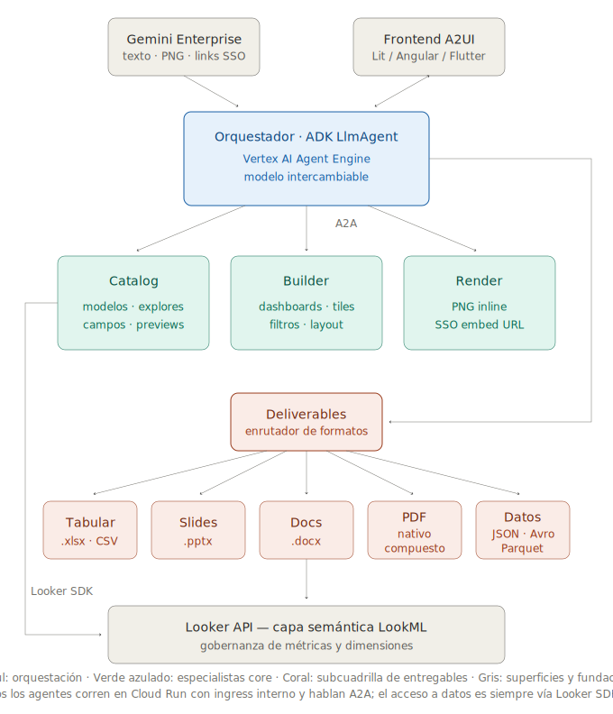
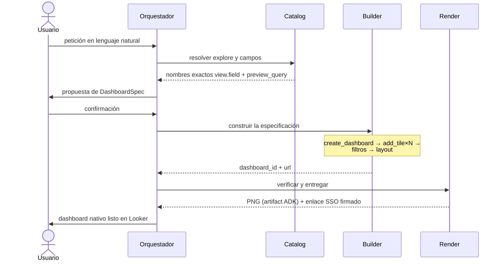

# bi-selfservice-agents

**Español** | [English](README.en.md) | [Français](README.fr.md) | [Português](README.pt.md)

Sistema multi-agente para autoservicio analítico sobre Looker. A partir de una petición en lenguaje natural, los agentes descubren el modelo semántico (LookML), proponen una especificación de dashboard, la construyen como contenido nativo de Looker mediante su API y la entregan verificada visualmente. Está construido sobre ADK (Agent Development Kit), se comunica internamente por el protocolo A2A, expone UI generativa mediante A2UI, y se despliega de extremo a extremo con Terraform en Google Cloud, con registro en Gemini Enterprise.

## Contenido

1. [Contexto y alcance](#1-contexto-y-alcance)
2. [Arquitectura](#2-arquitectura)
3. [Protocolos: A2A y A2UI](#3-protocolos-a2a-y-a2ui)
4. [Decisiones de diseño](#4-decisiones-de-diseño)
5. [Seguridad y gobernanza](#5-seguridad-y-gobernanza)
6. [Estructura del repositorio](#6-estructura-del-repositorio)
7. [Configuración](#7-configuración)
8. [Prerrequisitos](#8-prerrequisitos)
9. [Despliegue](#9-despliegue)
10. [Flujo de ejemplo](#10-flujo-de-ejemplo)
11. [Operación y resolución de problemas](#11-operación-y-resolución-de-problemas)
12. [Evolución prevista](#12-evolución-prevista)

---

## 1. Contexto y alcance

La primera generación de agentes conversacionales sobre plataformas de BI resuelve la *consulta*: responden preguntas puntuales y, en el mejor de los casos, renderizan una visualización como imagen dentro del chat. Ese patrón deja intacto el cuello de botella real del autoservicio: la **creación de contenido analítico** sigue dependiendo del equipo de BI, con colas de peticiones para cada tablero nuevo o cada variación de uno existente.

Este proyecto desplaza la frontera: el resultado de una conversación no es una respuesta efímera sino un **artefacto persistente y gobernado** — un dashboard user-defined real en Looker, con tiles respaldados por queries, filtros conectados entre tiles y layout definido, que el usuario puede abrir, editar y compartir con las mismas garantías que cualquier contenido creado a mano. La gobernanza no se relaja: todo lo que los agentes construyen pasa por la capa semántica LookML, que sigue siendo la única fuente de definiciones de métricas y dimensiones.

**Dentro del alcance:** descubrimiento del catálogo semántico, construcción y edición de dashboards (tiles, filtros, layout), verificación visual, entrega con enlaces firmados, dos superficies de consumo (Gemini Enterprise y frontend A2UI propio).
**Fuera del alcance (ver [Evolución prevista](#12-evolución-prevista)):** autoría de LookML, alertas y programaciones, otros backends de BI.

## 2. Arquitectura



*Proporciones del diagrama: cajas con razón ancho:alto ≈ φ (niveles) o φ² (barras), anchos por nivel en progresión Fibonacci ×8 (104 → 168 → 272 → 440). Fuente editable en `docs/img/arquitectura.svg`.*

### Responsabilidades

| Agente | Runtime | Responsabilidad | Tools principales (Looker SDK) |
|---|---|---|---|
| **Orchestrator** | Agent Engine (+ Cloud Run opcional para A2A/A2UI) | Interpreta la petición, negocia la especificación (`DashboardSpec`) con el usuario, delega a los especialistas, gestiona confirmaciones | — (consume sub-agentes `RemoteA2aAgent`) |
| **Catalog** | Cloud Run (A2A, ingress interno) | Autoridad de solo lectura sobre el modelo semántico: resuelve modelos, explores y nombres exactos `view.field`; valida especificaciones con previews reales | `all_lookml_models`, `lookml_model_explore`, `run_inline_query`, `search_dashboards` |
| **Builder** | Cloud Run (A2A, ingress interno) | Única ruta de escritura: materializa el dashboard nativo y sus componentes | `create_dashboard`, `create_query`, `create_dashboard_element`, `create_dashboard_filter`, layout components |
| **Render/QA** | Cloud Run (A2A, ingress interno) | Cierre del ciclo: verificación visual del resultado y entrega de acceso interactivo | `create_dashboard_render_task` (PNG → artifact ADK), `create_sso_embed_url` |
| **Deliverables** | Cloud Run (A2A, ingress interno) | Puerta única de entregables: enruta por formato a la subcuadrilla y consolida las URLs firmadas; pregunta una vez si el formato es ambiguo | — (consume a los 4 especialistas de formato vía `RemoteA2aAgent`) |
| **Tabular (Excel/CSV)** | Cloud Run (A2A, ingress interno) | Workbooks .xlsx con formato (query, multi-hoja, dashboard) y CSV plano para intercambio con sistemas | openpyxl, `export_query_to_excel`, `export_multi_sheet_excel`, `export_dashboard_to_excel`, `export_query_to_csv` |
| **Slides** | Cloud Run (A2A, ingress interno) | Presentaciones .pptx: portada + una lámina por tile (render PNG por query) con template corporativo | python-pptx, `create_query_render_task`, `export_dashboard_to_slides` |
| **Docs** | Cloud Run (A2A, ingress interno) | Reportes .docx (sección por tile con imagen + muestra de datos) y documentos narrativos por secciones | python-docx, `export_dashboard_to_docx`, `create_document` |
| **PDF** | Cloud Run (A2A, ingress interno) | Ruta nativa (render PDF de Looker, default) y ruta compuesta (portada + narrativa + anexo gráfico) | `create_dashboard_render_task(pdf)`, ReportLab, `compose_pdf_document` |
| **Data Exports** | Cloud Run (A2A, ingress interno) | Formatos machine-readable para sistemas: JSON, Parquet y Avro con esquema de tipos derivado de LookML (no adivinado de los datos); tope 100k filas por API | pyarrow, fastavro, `export_query_to_json/parquet/avro` |

### Ciclo de vida de una petición



Los entregables offline forman una **subcuadrilla de dos niveles**: el orquestador delega la intención ("mándamelo en slides") al Deliverables Agent, que enruta por formato al especialista correcto. El nivel intermedio se justifica con cuatro formatos — mantiene al orquestador ignorante de los detalles de cada uno — pero es deliberadamente el último nivel: la jerarquía no debe crecer a tres.

La separación lectura/validación (Catalog) — escritura (Builder) — verificación (Render) no es cosmética: acota el radio de acción de cada agente, permite auditar la ruta de escritura de forma aislada y habilita políticas IAM y de red distintas por responsabilidad.

## 3. Protocolos: A2A y A2UI

**A2A (Agent2Agent)** es el contrato entre el orquestador y los especialistas. Cada especialista publica su `AgentCard` en `/.well-known/agent-card.json` y atiende JSON-RPC sobre HTTP; el orquestador los descubre y consume como `RemoteA2aAgent` del ADK. Las consecuencias prácticas: cada agente se versiona, escala y despliega de forma independiente; un especialista puede reimplementarse en otro framework (LangGraph, un servicio propio) sin tocar al resto, siempre que respete el protocolo; y el sistema queda abierto a incorporar agentes de terceros que hablen A2A.

**A2UI** es el contrato entre el orquestador y la interfaz. En lugar de devolver HTML o código, el agente emite *blueprints* declarativos de componentes (JSON con data model y bindings) que viajan como `DataPart` con MIME `application/json+a2ui` dentro de la misma conexión A2A. El host los renderiza con sus propios componentes nativos, lo que mantiene el código ejecutable fuera del canal agente→UI (relevante para la frontera de confianza, ver §5) y hace la misma respuesta portable entre renderers (Lit, Angular, Flutter). El orquestador anuncia la extensión A2UI en su AgentCard; el contrato de UI (wizard de especificación, tarjeta de preview, confirmaciones destructivas) se inyecta en el system prompt vía `A2uiSchemaManager` solo cuando `A2UI_ENABLED=true`.

## 4. Decisiones de diseño

**El Catalog Agent como barrera anti-alucinación.** El riesgo dominante de un sistema que escribe contenido de BI es construir tiles sobre campos inexistentes o mal recordados. La regla del sistema es que el Builder solo acepta campos con nombre exacto `view.field` previamente resueltos por el Catalog contra LookML, y que toda especificación se valida con al menos un `preview_query` real antes de materializarse. El modelo nunca "recuerda" el esquema: lo consulta.

**Dos superficies, una lógica.** Gemini Enterprise no renderiza A2UI; el frontend propio sí. En lugar de bifurcar agentes, la diferencia se reduce a un flag por despliegue: en GE la experiencia se compone de texto, imágenes inline y enlaces firmados; en el frontend A2UI, de wizards y tarjetas interactivas. Los cuatro agentes y sus tools son idénticos en ambas superficies.

**Imágenes como artifacts, nunca como texto.** Los PNG de render se guardan mediante el mecanismo de artifacts del ADK (`tool_context.save_artifact`) y el runtime los muestra inline. Los bytes jamás atraviesan el texto del modelo — es la única vía fiable en Gemini Enterprise y evita respuestas infladas o truncadas.

**Modelo de razonamiento intercambiable.** El backend LLM se decide por configuración (`AGENT_MODEL_PROVIDER`), no por código, y puede fijarse por agente:

| Ruta | Backend | Cuándo usarla |
|---|---|---|
| `gemini` | Gemini en Vertex AI (string directo del ADK) | Default; sin requisitos adicionales |
| `claude` | Claude en Vertex AI vía LiteLlm | Claude con facturación y residencia en GCP |
| `claude_native` | Claude en Vertex vía wrapper nativo del ADK | Alternativa cuando la frontera de streaming GE↔LiteLlm da problemas |
| `anthropic` | API pública de Anthropic | Cuando no hay habilitación en Model Garden |

Una combinación razonable en producción: un modelo rápido y económico para el Catalog (alto volumen de llamadas, tarea acotada) y un modelo de mayor capacidad para el orquestador (negociación de la especificación con el usuario).

**Templates organizacionales antes que diseño libre.** Los dashboards y workbooks recurrentes se definen como templates versionados en `templates/` (YAML parametrizado con `{{ placeholders }}` para dashboards; `.xlsx` base con branding para Excel) que Terraform publica al bucket en cada apply. El orquestador los propone antes que un diseño desde cero — consistencia sobre creatividad —, pide solo los parámetros declarados, el Catalog valida cada campo y el Builder materializa con `create_dashboard_from_template`. Cambiar un template es un pull request, no una edición manual: la gobernanza del contenido recurrente queda en el mismo ciclo de revisión que el código.

**Regla anti-sprawl: cuándo un agente y cuándo una tool.** Para que la subcuadrilla no crezca sin criterio, la regla es explícita: un formato nuevo de una familia existente es una **tool** en el agente de esa familia (CSV y JSON no merecieron agente propio); una **familia** nueva de entregables — con dependencias, postura de riesgo y ciclo de evolución propios — es un **agente** en la subcuadrilla (Slides, PDF, Data Exports); y un **destino de publicación** (tablas Iceberg en el lakehouse, Google Drive) no es un entregable sino una integración: agente aparte, fuera de deliverables, con su propio proceso de aprobación. El fan-out se mantiene acotado por nivel (raíz: 4; deliverables: 5) y la jerarquía no crece a tres niveles.

**Enlaces firmados en tool separada.** `create_sso_embed_url` es independiente del render: producir el enlace interactivo nunca bloquea ni depende de la generación del PNG, y viceversa.

## 5. Seguridad y gobernanza

- **Mínimo privilegio en GCP.** Una única service account para los agentes con cuatro roles (`aiplatform.user`, `storage.objectAdmin`, `secretmanager.secretAccessor`, `logging.logWriter`). Quien despliega puede operar con un conjunto granular documentado en `docs/`.
- **Especialistas no expuestos.** Catalog, Builder y Render se despliegan con ingress interno y solo aceptan invocaciones autenticadas por IAM (`roles/run.invoker` para la SA del orquestador). La única superficie pública opcional es la A2A/A2UI del orquestador.
- **Credenciales de Looker solo en Secret Manager.** Nunca en variables de Terraform versionadas, imágenes ni logs. Los contenedores las reciben como referencias a secretos, no como valores.
- **Alcance acotado en Looker.** La allowlist `LOOKER_MODELS` limita qué modelos LookML son visibles para los agentes; `LOOKER_TARGET_FOLDER_ID` confina la escritura a un folder concreto cuyo permiso de edición controla el administrador de Looker. El permission set del usuario de servicio define el techo real de capacidades.
- **Operaciones destructivas con confirmación.** El borrado de dashboards es soft delete (papelera de Looker) y requiere confirmación explícita del usuario; en la superficie A2UI, mediante una tarjeta de confirmación dedicada.
- **Frontera de confianza en la UI.** A2UI garantiza que del agente a la interfaz solo viajan descripciones declarativas de componentes de un catálogo cerrado — nunca HTML ni scripts — lo que elimina la clase de riesgos de inyección de código en el canal de UI generativa.

## 6. Estructura del repositorio

```
agents/
├── common/            # model_factory (modelo intercambiable) + cliente Looker SDK
├── orchestrator/      # LlmAgent raíz + RemoteA2aAgent + contrato A2UI + entrypoints
│   ├── agent.py             #   sub_agents A2A
│   ├── a2ui_prompt.py       #   A2uiSchemaManager → system prompt con schema/examples
│   ├── agent_engine_app.py  #   entrypoint Agent Engine (AdkApp)
│   └── __main__.py          #   servidor A2A+A2UI (Cloud Run, frontend propio)
├── catalog_agent/     # descubrimiento semántico (lectura)
├── builder_agent/     # creación de dashboards (escritura)
├── render_agent/      # PNG inline (artifacts) + SSO embed
├── deliverables_agent/# enrutador de la subcuadrilla de formatos (A2A)
├── excel_agent/       # tabular: .xlsx con formato + CSV (openpyxl)
├── slides_agent/      # presentaciones .pptx (python-pptx + render por tile)
├── docs_agent/        # documentos .docx (python-docx)
├── pdf_agent/         # PDF nativo de Looker + compuesto (ReportLab)
├── data_exports_agent/# JSON/Parquet/Avro con esquema desde LookML (pyarrow/fastavro)
└── cloudbuild.yaml    # build por agente (contexto compartido con common/)

terraform/
├── versions.tf  variables.tf  outputs.tf  terraform.tfvars.example
├── foundation.tf        # APIs, SA + IAM mínimo, bucket, Secret Manager
├── cloud_run_agents.tf  # Artifact Registry, Cloud Build, 3 Cloud Run internos
│                        # + superficie A2A/A2UI pública del orquestador
├── agent_engine.tf      # empaquetado → GCS → Reasoning Engine → registro en GE
└── scripts/
    ├── build_source.py        # empaqueta common+orchestrator (tar.gz)
    ├── deploy_agent_engine.py # fallback de deploy vía SDK (agent_engines.create)
    └── register_agent.sh      # registro en Gemini Enterprise (Discovery Engine API)

frontend/README.md       # cómo conectar un renderer A2UI (Lit/Angular/Flutter/CopilotKit)
docs/                    # prerrequisitos para aprobación (cliente/proveedor)
templates/               # templates organizacionales (dashboards/*.yaml, excel/*.xlsx)
                         # versionados en git; terraform apply los publica al bucket
```

## 7. Configuración

Variables de entorno relevantes (Terraform las inyecta; se listan para operación y debugging):

| Variable | Ámbito | Descripción |
|---|---|---|
| `AGENT_MODEL_PROVIDER` | todos | `gemini` \| `claude` \| `claude_native` \| `anthropic` |
| `GEMINI_MODEL` / `CLAUDE_MODEL` | todos | Identificador del modelo por ruta |
| `CLAUDE_LOCATION` | todos | Región de Vertex que sirve Claude (p. ej. `us-east5`) |
| `LOOKERSDK_BASE_URL` | todos | URL de la API de Looker |
| `LOOKERSDK_CLIENT_ID` / `_SECRET` | todos | Referencias a Secret Manager |
| `LOOKER_MODELS` | todos | Allowlist JSON de modelos LookML |
| `LOOKER_TARGET_FOLDER_ID` | builder | Folder destino de los dashboards creados |
| `A2UI_ENABLED` | orquestador | Activa el contrato A2UI en el system prompt |
| `CATALOG/BUILDER/RENDER_AGENT_URL` | orquestador | Endpoints A2A de los especialistas |
| `PUBLIC_URL` | especialistas | URL que anuncia el AgentCard (Cloud Run) |
| `EXPORT_BUCKET` / `EXPORT_URL_EXPIRY_HOURS` | subcuadrilla | Bucket de exports y expiración de las URLs firmadas (default 24 h; limpieza automática a 7 días) |
| `EXCEL/SLIDES/DOCS/PDF/DATA_AGENT_URL` | deliverables | Endpoints A2A de los especialistas de formato |
| `DELIVERABLES_AGENT_URL` | orquestador | Puerta única de la subcuadrilla de entregables |
| `TEMPLATES_BUCKET` / `TEMPLATES_PREFIX` | todos | Ubicación de los templates organizacionales publicados por Terraform |

## 8. Prerrequisitos

- Proyecto GCP con billing; rol Owner o el conjunto granular documentado; `gcloud` autenticado; Terraform ≥ 1.7; `python3`.
- Instancia de **Looker** con credenciales API de un usuario de servicio cuyo permission set incluya `access_data`, `explore` y **escritura de dashboards** (`create_dashboards` / `manage_dashboards` sobre el folder destino), más un model set con los modelos autorizados.
- **Embed SSO habilitado** en Looker (Admin → Embed) para los enlaces interactivos.
- Una app de **Gemini Enterprise** creada (se necesita su id `AS_APP` y su location).
- Para rutas Claude: modelo habilitado en **Vertex AI Model Garden** (o `ANTHROPIC_API_KEY` para la ruta `anthropic`).

El detalle completo, organizado por equipo responsable y con hoja de firmas cliente/proveedor, está en `docs/prerrequisitos_looker_selfservice_agents.docx`.

## 9. Despliegue

```bash
cd terraform
cp terraform.tfvars.example terraform.tfvars   # y rellénalo
terraform init
terraform plan
terraform apply
```

Orden que resuelve Terraform: APIs → SA/IAM → bucket → secretos → build de imágenes (Cloud Build) → 3 Cloud Run internos → superficie A2A del orquestador → empaquetado + Reasoning Engine → registro en Gemini Enterprise (`register_agent.sh`).

> **Avisos:**
> 1. `google_vertex_ai_reasoning_engine` es reciente en `google-beta`: verifica los nombres anidados de `spec` contra la versión de tu provider. Si tu versión aún no soporta el empaquetado de fuente ADK, `scripts/deploy_agent_engine.py` alcanza el mismo estado final vía SDK; pasa el engine id resultante a `register_agent.sh`.
> 2. El registro en Gemini Enterprise no es idempotente (no existe recurso nativo de Terraform aún): re-aplicar puede duplicar el agente en la app.
> 3. Los pins de `requirements.txt` son de referencia: fija las versiones exactas que valides en tu build para que build y runtime coincidan.

## 10. Flujo de ejemplo

Petición en Gemini Enterprise:

> «Quiero un tablero de ventas de e-commerce: ingresos por mes, top 10 países por órdenes, ticket promedio como single value y una tabla de órdenes por estado. Filtro global por país.»

1. El orquestador delega al **Catalog**: resuelve `thelook/order_items`, obtiene los nombres exactos (`orders.created_month`, `order_items.total_revenue`, …) y ejecuta un `preview_query` de validación.
2. Propone el `DashboardSpec` (título, cuatro tiles con campos y tipo de visualización, filtro global, layout a dos columnas) y espera confirmación.
3. El **Builder** ejecuta la secuencia `create_dashboard` → 4× `add_tile` → `add_dashboard_filter` + `wire_filter_to_tiles` → `apply_grid_layout(2)` y devuelve `dashboard_id` y URL.
4. El **Render** entrega el PNG inline y el enlace SSO firmado.
5. El dashboard queda en el folder destino de Looker: nativo, editable y compartible. Un «y mándamelo en Excel y en slides para el comité» posterior delega al **Deliverables Agent**, que enruta a los especialistas de formato y consolida las URLs firmadas de descarga.

En el frontend A2UI, los pasos 1–2 se presentan como un wizard interactivo (selección de explore, campos y tipos de gráfico) y el paso 4 como una tarjeta de preview con acciones — mismos agentes, sin lógica duplicada.

## 11. Operación y resolución de problemas

| Síntoma | Causa probable y acción |
|---|---|
| `cannot access data` | Permission set o model set insuficiente en las credenciales API de Looker. `list_models` muestra el alcance real. |
| El Builder falla creando tiles | Falta `create_dashboards`/`manage_dashboards`, o `LOOKER_TARGET_FOLDER_ID` no es escribible por el usuario de servicio. |
| Claude responde en `stream_query` directo pero GE devuelve vacío | Frontera de streaming GE↔LiteLlm. Cambiar a `claude_native`, o `gemini` en el agente que da la cara a GE (los especialistas pueden permanecer en Claude). |
| `Environment variable 'GOOGLE_CLOUD_PROJECT' is reserved` | Agent Engine define esa variable; el proyecto usa `VERTEXAI_PROJECT`/`VERTEXAI_LOCATION` precisamente por eso. |
| El AgentCard de un especialista anuncia `localhost` | `PUBLIC_URL` ausente o incorrecta en la revisión de Cloud Run. |
| El render expira (timeout) | Servicio de render de Looker saturado o deshabilitado; verificar render tasks en la instancia. |

Observabilidad: los cuatro agentes escriben a Cloud Logging (rol `logging.logWriter`); las trazas del ADK pueden habilitarse en `agent_engine_app.py` (`enable_tracing=True`) para inspección en Cloud Trace.

## 12. Evolución prevista

El prefijo `bi-` del proyecto es deliberado: la arquitectura no está acoplada a Looker más que en las tools de los especialistas. Extensiones naturales, cada una como un nuevo agente A2A sin tocar los existentes:

- **Ruta de gran volumen para Data Exports** — sobre ~100k filas, delegar a BigQuery el `EXPORT DATA (format='PARQUET')` usando el SQL que Looker genera para el query: los datos no pasan por el agente y la gobernanza se preserva (el SQL nace de LookML). Requiere `bigquery.jobUser` y lectura del dataset.
- **Fuera de alcance por diseño**: publicación a formatos de *tabla* (Iceberg/BigLake). No son entregables sino destinos; pertenecerían a un Data Publisher Agent con proceso de aprobación propio, no a la subcuadrilla.
- **Salida a Google Workspace** — cada especialista de formato puede ofrecer, además del archivo descargable, su equivalente colaborativo (Google Sheets/Slides/Docs vía API) entregado como enlace en Drive; requiere resolver scopes de la service account y el Drive compartido destino.
- **LookML Author Agent** — proponer nuevas dimensiones/medidas como pull requests al repositorio LookML, cerrando el ciclo de gobernanza cuando el catálogo no cubre una petición.
- **Scheduler Agent** — alertas y entregas programadas (`create_scheduled_plan`) sobre los dashboards creados.
- **Especialistas para otros backends** — un Builder equivalente para otra plataforma de BI reutilizaría íntegros el orquestador, el contrato A2UI y el patrón Catalog/Builder/Render.
- **Evaluación continua** — batería de peticiones de referencia contra un entorno de staging para medir regresiones de calidad al cambiar de modelo o versión de agente.

## Autor

Jose Maldonado
