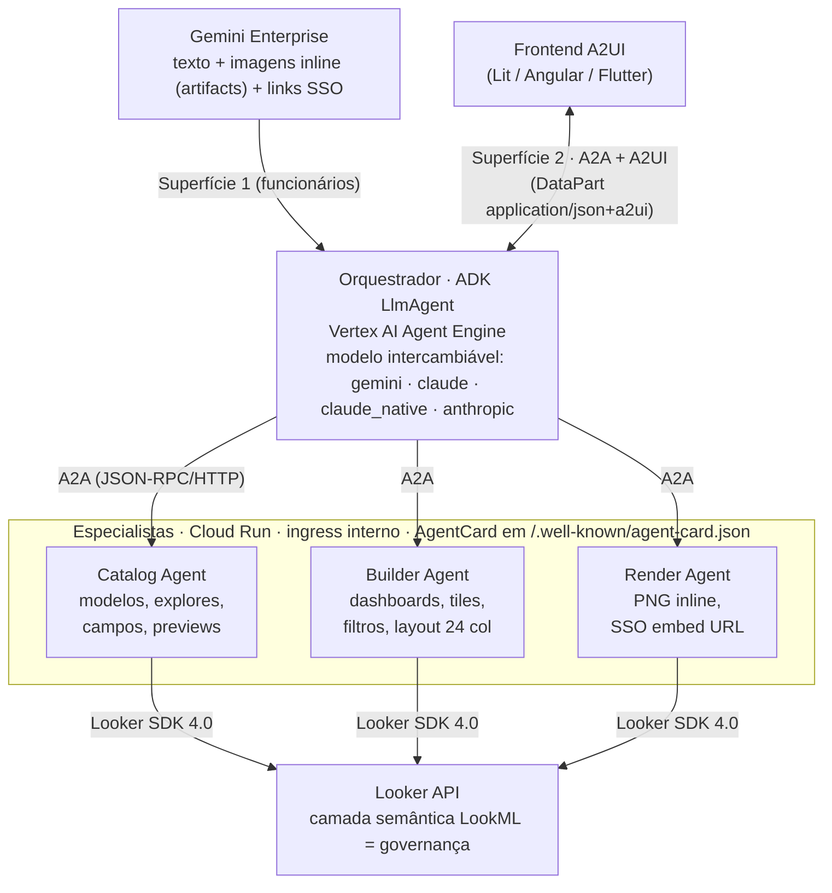
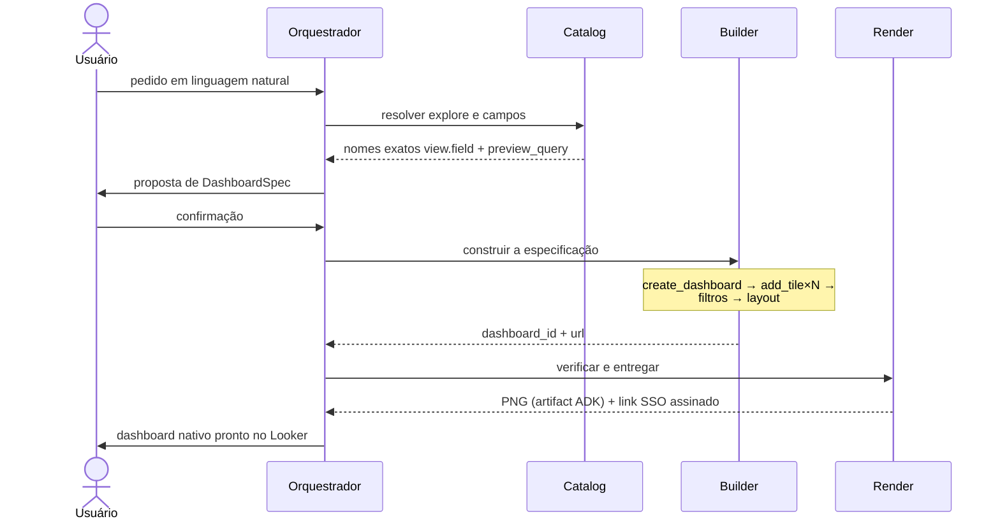

# bi-selfservice-agents

[Español](README.md) | [English](README.en.md) | [Français](README.fr.md) | **Português**

Sistema multiagente para autoatendimento analítico sobre o Looker. A partir de um pedido em linguagem natural, os agentes descobrem o modelo semântico (LookML), propõem uma especificação de dashboard, a constroem como conteúdo nativo do Looker por meio de sua API e a entregam verificada visualmente. É construído sobre o ADK (Agent Development Kit), comunica-se internamente pelo protocolo A2A, expõe UI generativa mediante A2UI e é implantado de ponta a ponta com Terraform no Google Cloud, com registro no Gemini Enterprise.

## Conteúdo

1. [Contexto e escopo](#1-contexto-e-escopo)
2. [Arquitetura](#2-arquitetura)
3. [Protocolos: A2A e A2UI](#3-protocolos-a2a-e-a2ui)
4. [Decisões de design](#4-decisões-de-design)
5. [Segurança e governança](#5-segurança-e-governança)
6. [Estrutura do repositório](#6-estrutura-do-repositório)
7. [Configuração](#7-configuração)
8. [Pré-requisitos](#8-pré-requisitos)
9. [Implantação](#9-implantação)
10. [Fluxo de exemplo](#10-fluxo-de-exemplo)
11. [Operação e solução de problemas](#11-operação-e-solução-de-problemas)
12. [Evolução prevista](#12-evolução-prevista)

---

## 1. Contexto e escopo

A primeira geração de agentes conversacionais sobre plataformas de BI resolve a *consulta*: respondem perguntas pontuais e, no melhor dos casos, renderizam uma visualização como imagem dentro do chat. Esse padrão deixa intacto o verdadeiro gargalo do autoatendimento: a **criação de conteúdo analítico** continua dependendo da equipe de BI, com filas de solicitações para cada painel novo ou cada variação de um existente.

Este projeto desloca a fronteira: o resultado de uma conversa não é uma resposta efêmera, e sim um **artefato persistente e governado** — um dashboard user-defined real no Looker, com tiles respaldados por queries, filtros cross-tile e layout definido, que o usuário pode abrir, editar e compartilhar com as mesmas garantias de qualquer conteúdo criado manualmente. A governança não é relaxada: tudo o que os agentes constroem passa pela camada semântica LookML, que continua sendo a única fonte das definições de métricas e dimensões.

**Dentro do escopo:** descoberta do catálogo semântico, criação e edição de dashboards (tiles, filtros, layout), verificação visual, entrega com links assinados, duas superfícies de consumo (Gemini Enterprise e um frontend A2UI próprio).
**Fora do escopo (ver [Evolução prevista](#12-evolução-prevista)):** autoria de LookML, alertas e agendamentos, outros backends de BI.

## 2. Arquitetura



### Responsabilidades

| Agente | Runtime | Responsabilidade | Tools principais (Looker SDK) |
|---|---|---|---|
| **Orchestrator** | Agent Engine (+ Cloud Run opcional para A2A/A2UI) | Interpreta o pedido, negocia a especificação (`DashboardSpec`) com o usuário, delega aos especialistas, gerencia confirmações | — (consome sub-agentes `RemoteA2aAgent`) |
| **Catalog** | Cloud Run (A2A, ingress interno) | Autoridade somente leitura sobre o modelo semântico: resolve modelos, explores e nomes exatos `view.field`; valida especificações com previews reais | `all_lookml_models`, `lookml_model_explore`, `run_inline_query`, `search_dashboards` |
| **Builder** | Cloud Run (A2A, ingress interno) | O único caminho de escrita: materializa o dashboard nativo e seus componentes | `create_dashboard`, `create_query`, `create_dashboard_element`, `create_dashboard_filter`, layout components |
| **Render/QA** | Cloud Run (A2A, ingress interno) | Fecha o ciclo: verificação visual do resultado e entrega do acesso interativo | `create_dashboard_render_task` (PNG → artifact ADK), `create_sso_embed_url` |

### Ciclo de vida de um pedido



A separação leitura/validação (Catalog) — escrita (Builder) — verificação (Render) não é cosmética: delimita o raio de ação de cada agente, permite auditar o caminho de escrita de forma isolada e habilita políticas de IAM e de rede distintas por responsabilidade.

## 3. Protocolos: A2A e A2UI

**A2A (Agent2Agent)** é o contrato entre o orquestrador e os especialistas. Cada especialista publica seu `AgentCard` em `/.well-known/agent-card.json` e atende JSON-RPC sobre HTTP; o orquestrador os descobre e consome como `RemoteA2aAgent` do ADK. As consequências práticas: cada agente é versionado, escalado e implantado de forma independente; um especialista pode ser reimplementado em outro framework (LangGraph, um serviço próprio) sem tocar no restante, desde que respeite o protocolo; e o sistema fica aberto a incorporar agentes de terceiros que falem A2A.

**A2UI** é o contrato entre o orquestrador e a interface. Em vez de devolver HTML ou código, o agente emite *blueprints* declarativos de componentes (JSON com data model e bindings) que viajam como `DataPart` com MIME `application/json+a2ui` na mesma conexão A2A. O host os renderiza com seus próprios componentes nativos, o que mantém código executável fora do canal agente→UI (relevante para a fronteira de confiança, ver §5) e torna a mesma resposta portável entre renderers (Lit, Angular, Flutter). O orquestrador anuncia a extensão A2UI no seu AgentCard; o contrato de UI (wizard de especificação, cartão de preview, confirmações destrutivas) é injetado no system prompt via `A2uiSchemaManager` apenas quando `A2UI_ENABLED=true`.

## 4. Decisões de design

**O Catalog Agent como barreira anti-alucinação.** O risco dominante de um sistema que escreve conteúdo de BI é construir tiles sobre campos inexistentes ou mal lembrados. A regra do sistema é que o Builder só aceita campos com nome exato `view.field` previamente resolvidos pelo Catalog contra o LookML, e que toda especificação é validada com pelo menos um `preview_query` real antes de ser materializada. O modelo nunca "lembra" o esquema: ele o consulta.

**Duas superfícies, uma lógica.** O Gemini Enterprise não renderiza A2UI; o frontend próprio, sim. Em vez de bifurcar agentes, a diferença se reduz a uma flag por implantação: no GE, a experiência é composta de texto, imagens inline e links assinados; no frontend A2UI, de wizards e cartões interativos. Os quatro agentes e suas tools são idênticos nas duas superfícies.

**Imagens como artifacts, nunca como texto.** Os PNG de render são armazenados pelo mecanismo de artifacts do ADK (`tool_context.save_artifact`) e o runtime os exibe inline. Os bytes jamais atravessam o texto do modelo — é o único caminho confiável no Gemini Enterprise e evita respostas infladas ou truncadas.

**Modelo de raciocínio intercambiável.** O backend LLM é decidido por configuração (`AGENT_MODEL_PROVIDER`), não por código, e pode ser fixado por agente:

| Rota | Backend | Quando usar |
|---|---|---|
| `gemini` | Gemini no Vertex AI (string direta do ADK) | Default; sem requisitos adicionais |
| `claude` | Claude no Vertex AI via LiteLlm | Claude com faturamento e residência no GCP |
| `claude_native` | Claude no Vertex via wrapper nativo do ADK | Alternativa quando a fronteira de streaming GE↔LiteLlm apresenta problemas |
| `anthropic` | API pública da Anthropic | Quando não há habilitação no Model Garden |

Uma combinação razoável em produção: um modelo rápido e econômico para o Catalog (alto volume de chamadas, tarefa delimitada) e um modelo de maior capacidade para o orquestrador (negociação da especificação com o usuário).

**Links assinados em tool separada.** `create_sso_embed_url` é independente do render: produzir o link interativo nunca bloqueia nem depende da geração do PNG, e vice-versa.

## 5. Segurança e governança

- **Mínimo privilégio no GCP.** Uma única service account para os agentes com quatro papéis (`aiplatform.user`, `storage.objectAdmin`, `secretmanager.secretAccessor`, `logging.logWriter`). Quem implanta pode operar com um conjunto granular documentado em `docs/`.
- **Especialistas não expostos.** Catalog, Builder e Render são implantados com ingress interno e só aceitam invocações autenticadas por IAM (`roles/run.invoker` para a SA do orquestrador). A única superfície pública opcional é a A2A/A2UI do orquestrador.
- **Credenciais do Looker apenas no Secret Manager.** Nunca em variáveis do Terraform versionadas, imagens ou logs. Os contêineres as recebem como referências a secrets, não como valores.
- **Escopo delimitado no Looker.** A allowlist `LOOKER_MODELS` limita quais modelos LookML são visíveis para os agentes; `LOOKER_TARGET_FOLDER_ID` confina a escrita a uma pasta específica cuja permissão de edição é controlada pelo administrador do Looker. O permission set do usuário de serviço define o teto real de capacidades.
- **Operações destrutivas com confirmação.** A exclusão de dashboards é soft delete (lixeira do Looker) e exige confirmação explícita do usuário; na superfície A2UI, mediante um cartão de confirmação dedicado.
- **Fronteira de confiança na UI.** O A2UI garante que do agente para a interface viajam apenas descrições declarativas de componentes de um catálogo fechado — nunca HTML nem scripts — o que elimina a classe de riscos de injeção de código no canal de UI generativa.

## 6. Estrutura do repositório

```
agents/
├── common/            # model_factory (modelo intercambiável) + cliente Looker SDK
├── orchestrator/      # LlmAgent raiz + RemoteA2aAgent + contrato A2UI + entrypoints
│   ├── agent.py             #   sub_agents A2A
│   ├── a2ui_prompt.py       #   A2uiSchemaManager → system prompt com schema/exemplos
│   ├── agent_engine_app.py  #   entrypoint do Agent Engine (AdkApp)
│   └── __main__.py          #   servidor A2A+A2UI (Cloud Run, frontend próprio)
├── catalog_agent/     # descoberta semântica (leitura)
├── builder_agent/     # criação de dashboards (escrita)
├── render_agent/      # PNG inline (artifacts) + SSO embed
└── cloudbuild.yaml    # build por agente (contexto compartilhado com common/)

terraform/
├── versions.tf  variables.tf  outputs.tf  terraform.tfvars.example
├── foundation.tf        # APIs, SA + IAM de mínimo privilégio, bucket, Secret Manager
├── cloud_run_agents.tf  # Artifact Registry, Cloud Build, 3 Cloud Run internos
│                        # + superfície A2A/A2UI pública do orquestrador
├── agent_engine.tf      # empacotamento → GCS → Reasoning Engine → registro no GE
└── scripts/
    ├── build_source.py        # empacota common+orchestrator (tar.gz)
    ├── deploy_agent_engine.py # fallback de deploy via SDK (agent_engines.create)
    └── register_agent.sh      # registro no Gemini Enterprise (Discovery Engine API)

frontend/README.md       # como conectar um renderer A2UI (Lit/Angular/Flutter/CopilotKit)
docs/                    # pré-requisitos para aprovação (cliente/fornecedor)
```

## 7. Configuração

Variáveis de ambiente relevantes (o Terraform as injeta; listadas para operação e depuração):

| Variável | Escopo | Descrição |
|---|---|---|
| `AGENT_MODEL_PROVIDER` | todos | `gemini` \| `claude` \| `claude_native` \| `anthropic` |
| `GEMINI_MODEL` / `CLAUDE_MODEL` | todos | Identificador do modelo por rota |
| `CLAUDE_LOCATION` | todos | Região do Vertex que serve o Claude (p. ex. `us-east5`) |
| `LOOKERSDK_BASE_URL` | todos | URL da API do Looker |
| `LOOKERSDK_CLIENT_ID` / `_SECRET` | todos | Referências ao Secret Manager |
| `LOOKER_MODELS` | todos | Allowlist JSON de modelos LookML |
| `LOOKER_TARGET_FOLDER_ID` | builder | Pasta de destino dos dashboards criados |
| `A2UI_ENABLED` | orquestrador | Ativa o contrato A2UI no system prompt |
| `CATALOG/BUILDER/RENDER_AGENT_URL` | orquestrador | Endpoints A2A dos especialistas |
| `PUBLIC_URL` | especialistas | URL anunciada pelo AgentCard (Cloud Run) |

## 8. Pré-requisitos

- Projeto GCP com billing; papel Owner ou o conjunto granular documentado; `gcloud` autenticado; Terraform ≥ 1.7; `python3`.
- Instância do **Looker** com credenciais de API de um usuário de serviço cujo permission set inclua `access_data`, `explore` e **escrita de dashboards** (`create_dashboards` / `manage_dashboards` sobre a pasta de destino), além de um model set com os modelos autorizados.
- **Embed SSO habilitado** no Looker (Admin → Embed) para os links interativos.
- Um app do **Gemini Enterprise** criado (são necessários seu id `AS_APP` e sua location).
- Para rotas Claude: modelo habilitado no **Vertex AI Model Garden** (ou `ANTHROPIC_API_KEY` para a rota `anthropic`).

O detalhamento completo, organizado por equipe responsável e com folha de assinaturas cliente/fornecedor, está em `docs/prerrequisitos_looker_selfservice_agents.docx`.

## 9. Implantação

```bash
cd terraform
cp terraform.tfvars.example terraform.tfvars   # e preencha
terraform init
terraform plan
terraform apply
```

Ordem resolvida pelo Terraform: APIs → SA/IAM → bucket → secrets → build das imagens (Cloud Build) → 3 Cloud Run internos → superfície A2A do orquestrador → empacotamento + Reasoning Engine → registro no Gemini Enterprise (`register_agent.sh`).

> **Avisos:**
> 1. `google_vertex_ai_reasoning_engine` é recente no `google-beta`: verifique os nomes aninhados de `spec` contra a versão do seu provider. Se a sua versão ainda não suporta o empacotamento de fonte ADK, `scripts/deploy_agent_engine.py` alcança o mesmo estado final via SDK; passe o engine id resultante para `register_agent.sh`.
> 2. O registro no Gemini Enterprise não é idempotente (ainda não existe recurso nativo do Terraform): reaplicar pode duplicar o agente no app.
> 3. Os pins do `requirements.txt` são de referência: fixe as versões exatas validadas no seu build para que build e runtime coincidam.

## 10. Fluxo de exemplo

Pedido no Gemini Enterprise:

> «Quero um painel de vendas de e-commerce: receita por mês, top 10 países por pedidos, ticket médio como single value e uma tabela de pedidos por status. Filtro global por país.»

1. O orquestrador delega ao **Catalog**: resolve `thelook/order_items`, obtém os nomes exatos (`orders.created_month`, `order_items.total_revenue`, …) e executa um `preview_query` de validação.
2. Ele propõe o `DashboardSpec` (título, quatro tiles com campos e tipo de visualização, filtro global, layout em duas colunas) e aguarda confirmação.
3. O **Builder** executa a sequência `create_dashboard` → 4× `add_tile` → `add_dashboard_filter` + `wire_filter_to_tiles` → `apply_grid_layout(2)` e devolve o `dashboard_id` e a URL.
4. O **Render** entrega o PNG inline e o link SSO assinado.
5. O dashboard fica na pasta de destino do Looker: nativo, editável e compartilhável.

No frontend A2UI, os passos 1–2 são apresentados como um wizard interativo (seleção de explore, campos e tipos de gráfico) e o passo 4 como um cartão de preview com ações — mesmos agentes, sem lógica duplicada.

## 11. Operação e solução de problemas

| Sintoma | Causa provável e ação |
|---|---|
| `cannot access data` | Permission set ou model set insuficiente nas credenciais de API do Looker. `list_models` mostra o alcance real. |
| O Builder falha ao criar tiles | Falta `create_dashboards`/`manage_dashboards`, ou `LOOKER_TARGET_FOLDER_ID` não é gravável pelo usuário de serviço. |
| Claude responde em `stream_query` direto mas o GE devolve vazio | Fronteira de streaming GE↔LiteLlm. Mudar para `claude_native`, ou `gemini` no agente exposto ao GE (os especialistas podem continuar no Claude). |
| `Environment variable 'GOOGLE_CLOUD_PROJECT' is reserved` | O Agent Engine define essa variável sozinho; o projeto usa `VERTEXAI_PROJECT`/`VERTEXAI_LOCATION` exatamente por isso. |
| O AgentCard de um especialista anuncia `localhost` | `PUBLIC_URL` ausente ou incorreta na revisão do Cloud Run. |
| O render expira (timeout) | Serviço de render do Looker saturado ou desabilitado; verificar render tasks na instância. |

Observabilidade: os quatro agentes escrevem no Cloud Logging (papel `logging.logWriter`); os traces do ADK podem ser habilitados em `agent_engine_app.py` (`enable_tracing=True`) para inspeção no Cloud Trace.

## 12. Evolução prevista

O prefixo `bi-` do projeto é deliberado: a arquitetura só está acoplada ao Looker nas tools dos especialistas. Extensões naturais, cada uma como um novo agente A2A sem tocar nos existentes:

- **LookML Author Agent** — propor novas dimensões/medidas como pull requests ao repositório LookML, fechando o ciclo de governança quando o catálogo não cobre um pedido.
- **Scheduler Agent** — alertas e entregas agendadas (`create_scheduled_plan`) sobre os dashboards criados.
- **Especialistas para outros backends** — um Builder equivalente para outra plataforma de BI reutilizaria integralmente o orquestrador, o contrato A2UI e o padrão Catalog/Builder/Render.
- **Avaliação contínua** — bateria de pedidos de referência contra um ambiente de staging para medir regressões de qualidade ao trocar de modelo ou versão de agente.

## Autor

Jose Maldonado
